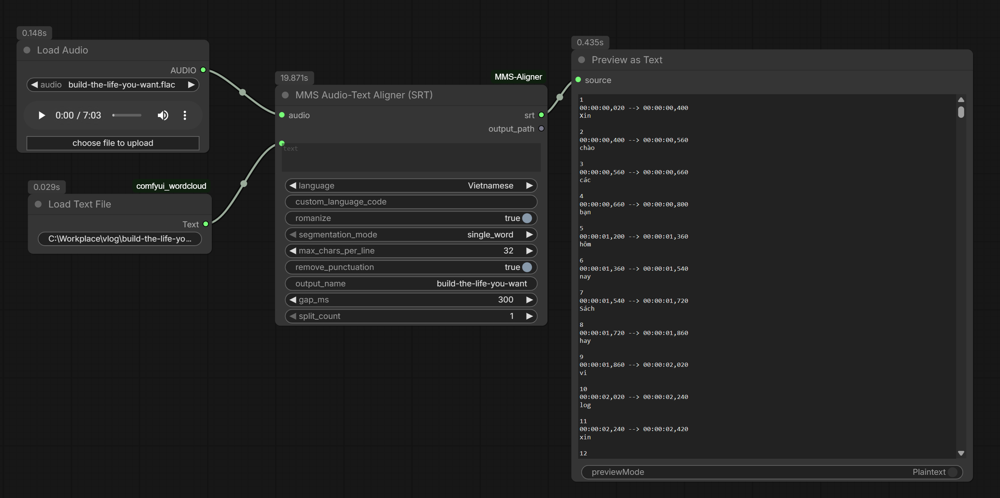

# ComfyUI-MMS-Aligner

A ComfyUI custom node that force-aligns an audio clip with its text transcript and writes a timestamped **SRT subtitle file**.

Uses Meta's **`facebook/mms-1b-fl102`** model (102 languages, FLEURS-trained) via `transformers` + `torchaudio.functional.forced_align`. **Pure Python — no C++ compilation, no MSVC, no extra build tools.**

## Why FL102?

`facebook/mms-1b-fl102` is the only MMS model used by this node. It covers 102 languages, trained on the cleaner FLEURS dataset, with per-language adapters (each language uses its own native tokenizer — no romanization required for the common cases).

If your language isn't in FL102, this node won't work for you — but for the languages most people actually need (English, Vietnamese, Chinese Mandarin, Spanish, French, German, Japanese, Korean, Arabic, Hindi, Russian, etc.), it does.

## Screenshots



## Features

- One node: audio + text in → SRT out (string and/or file).
- Single model, auto-downloaded to `ComfyUI/models/mms/facebook__mms-1b-fl102/` on first use (~3.2 GB).
- Pure-Python install: no compiler, no headaches on Windows.
- Language: ~30 common languages in a dropdown, any ISO 639-3 code via `custom`, or auto-detect from the text.
- Optional `romanize` fallback (uroman) for edge cases.
- Six segmentation modes: single-word (karaoke-style), max chars, punctuation, newlines, or combinations.
- Optional cue-gap bridging (`gap_ms`) to eliminate sub-300 ms flicker between consecutive cues.
- Optional output splitting (`split_count`, up to 5) to emit `name_1.srt`, `name_2.srt`, … for chunked workflows.
- Tooltips on every input.
- All processing in-memory — no temp WAV files written.

## Installation

### Manual
```bash
cd ComfyUI/custom_nodes
git clone https://github.com/idealweek/ComfyUI-MMS-Aligner
cd ComfyUI-MMS-Aligner
pip install -r requirements.txt
```

Restart ComfyUI. The node appears under **`audio/alignment`** as **"MMS Audio-Text Aligner (SRT)"**.

> Requirements: `torch` and `torchaudio` are already provided by ComfyUI. The extras (`transformers`, `huggingface_hub`, `uroman`, `lingua-language-detector`) are pure Python.

## Usage

1. Add a **LoadAudio** node and connect its output to the aligner's `audio` input.
2. Type or wire the transcript into the `text` input.
3. Pick `language` and `segmentation_mode` (use `single_word` for karaoke-style one-word-per-cue output).
4. Set `output_name` (no extension — `.srt` is added automatically). Files are written into ComfyUI's output directory. The `srt` string output is always populated.
5. (Optional) raise `split_count` (max 5) to split the result into `output_name_1.srt`, `output_name_2.srt`, …
6. (Optional) tune `gap_ms` to bridge tiny silences between consecutive cues — handy for `single_word` mode to prevent flicker.

### Example — Vietnamese

| Input | Value |
|---|---|
| `audio` | (from LoadAudio) |
| `text` | `Xin chào, đây là một ví dụ.\nMột dòng nữa.` |
| `language` | `Vietnamese` |
| `romanize` | `False` |
| `segmentation_mode` | `max_chars+punctuation+newlines` |
| `max_chars_per_line` | `42` |
| `gap_ms` | `300` |
| `output_name` | `subs` |
| `split_count` | `1` |

Output (`srt`):
```
1
00:00:00,120 --> 00:00:02,340
Xin chào, đây là một ví dụ.

2
00:00:02,500 --> 00:00:03,820
Một dòng nữa.
```

## Inputs

| Field | Type | Default | Description |
|---|---|---|---|
| `audio` | AUDIO | — | ComfyUI audio. Resampled to 16 kHz mono internally. |
| `text` | STRING (multiline) | `""` | Transcript. |
| `language` | enum | `auto` | `auto`, ~30 common languages, or `custom`. |
| `custom_language_code` | STRING | `""` | ISO 639-3 (used only when `language=custom`). |
| `romanize` | BOOL | `False` | Optional fallback. Usually leave off — the per-language tokenizer handles native scripts. |
| `segmentation_mode` | enum | `max_chars+punctuation+newlines` | See below. |
| `max_chars_per_line` | INT | `42` | `0` disables the cap. |
| `remove_punctuation` | BOOL | `False` | Strip `.,!?;:"()[]{}—–…«»“”‘’` from SRT lines (keeps apostrophes/hyphens). Doesn't affect segmentation. |
| `gap_ms` | INT | `300` | Bridge consecutive cues whose gap is under this many ms by snapping `prev.end` to `next.start`. Real pauses (≥ `gap_ms`) are preserved. `0` disables. |
| `output_name` | STRING | `"subtitles"` | Base file name (no extension) written to ComfyUI's output dir. `.srt` is appended automatically; path separators are stripped. |
| `split_count` | INT | `1` | `1` = single file. `2`–`5` splits cues into near-equal chunks named `<output_name>_1.srt`, `<output_name>_2.srt`, … |

### Segmentation modes
- **`single_word`** — one word per cue (karaoke-style). Pair with `gap_ms` to avoid flicker.
- **`max_chars`** — pack words greedily up to `max_chars_per_line`.
- **`punctuation`** — break at `.` `!` `?` `,` `;` `:`.
- **`newlines`** — break wherever the input text has a line break.
- **`max_chars+punctuation`** — both.
- **`max_chars+punctuation+newlines`** — all three.

## Outputs

- **`srt`** (STRING) — full SRT content (un-split, even when `split_count` > 1).
- **`output_path`** (STRING) — newline-separated list of paths written to disk (one entry when `split_count=1`, N entries otherwise).

## How it works

1. **Resample** the input audio to 16 kHz mono in memory.
2. **Detect** the language from the transcript (lingua) when `language=auto`.
3. **Download** `facebook/mms-1b-fl102` to `ComfyUI/models/mms/` on first run (cached after).
4. **Load** the model with the per-language adapter (`model.load_adapter(lang)` and `processor.tokenizer.set_target_lang(lang)`).
5. **Tokenize** each transcript word with the language's native tokenizer (optionally romanize first).
6. **Get emissions** via a single forward pass; convert to log-probs.
7. **Force-align** with `torchaudio.functional.forced_align`; merge token spans into word boundaries.
8. **Segment** word timings into SRT cues per the chosen mode.
9. **Emit** the SRT as a string and (optionally) write to disk.

## Troubleshooting

- **"Could not auto-detect language"** — text too short or mixed; set `language` explicitly.
- **"Transcript produced no alignable tokens"** — text contains characters not in the language's tokenizer vocab. Try `romanize=True`, or check the language code.
- **Slow first run** — model is downloading (~3.2 GB); subsequent runs use the cache.
- **Wrong language adapter** — make sure the ISO 639-3 code matches one of the FL102 languages.

## License

[MIT](LICENSE)

## Credits

- [Meta MMS — `facebook/mms-1b-fl102`](https://huggingface.co/facebook/mms-1b-fl102)
- [`transformers`](https://github.com/huggingface/transformers) — model loading & adapters
- [`torchaudio.functional.forced_align`](https://docs.pytorch.org/audio/main/generated/torchaudio.functional.forced_align.html) — alignment math
- [`uroman`](https://pypi.org/project/uroman/) — pure-Python universal romanizer (ISI)
- [`lingua-language-detector`](https://github.com/pemistahl/lingua-py) — text language detection
